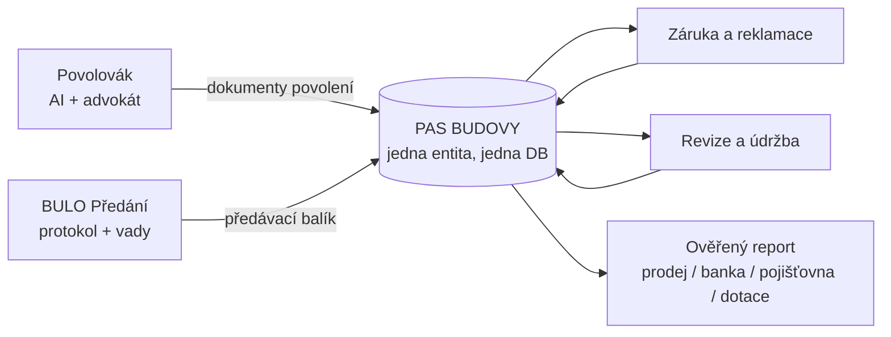

# Platforma: Povolovák (+ právníci) × BULO — jedna datová páteř budovy

> Syntéza [Povolováku s právníky](./povolovak-pravnici-model.md) a [strategie BULO](./bulo-strategie.md). Nápad: povolovák vyřídí povolení, dokumenty se rovnou uloží do BULO (pas budovy), tam žijí dál — a platí se za výstupy. Verdikt: **ano, tohle je správný endgame — a spojení řeší největší slabinu obou produktů.**

---

## 1. Proč spojení dává smysl (víc než součet částí)

**Povolovák řeší cold-start BULO.** Nejtěžší problém každého „pasu budovy" je: kdo tam naláduje data? Nikdo nescanuje šanony dobrovolně. Ve spojené platformě data vznikají **jako vedlejší produkt povolování**: projektová dokumentace, vyjádření, rozhodnutí, situační výkresy — vše už prošlo systémem a jedním klikem se stává základem pasu. Pas se naplní dřív, než se kopne do země.

**BULO řeší jednorázovost Povolováku.** Povolení je transakce (klient zaplatí a odejde). S napojením na BULO se z transakce stává **celoživotní vztah**: povolení → stavba → předání → záruka → revize → prodej. Každá fáze má svůj платící moment a data se nesou dál.

**Právníci dodávají to nejcennější: ověřenost.** Pas budovy, kde dokumenty prošly advokátní kontrolou, není „složka s PDF" — je to **ověřený záznam** (provenance). To je přesně to, za co zaplatí třetí strany: kupec, banka, pojišťovna.

**Nikdo v ČR tenhle řetěz nedrží.** PlanRadar žije jen ve fázi stavby, pozemkové reporty jen před koupí, facility systémy jen u velkých budov. Kontinuita povolení→provoz je volná — a je to přesně „celý systém v rámci stavby", který chceš, jen poskládaný v pořadí, v jakém si na sebe vydělá.

---

## 2. Architektura: jeden pas, dva vstupy, platby na milnících

- **Vstup 1 (začátek života budovy):** Povolovák — klient přijde kvůli povolení, odejde s pasem, kde už je celá dokumentace.
- **Vstup 2 (konec stavby):** BULO předání — developer/stavitel předá jednotku, kupující dostane pas s dokumentací.
- Dva nezávislé akviziční kanály, **jedna databáze, jedna entita „Stavba/Nemovitost"**. Zákazník může vstoupit kterýmikoli dveřmi.

## 3. Monetizace po životním cyklu (kde a za co se platí)

| Milník | Kdo platí | Kolik | Poznámka |
|---|---|---|---|
| Povolení (AI + advokát) | stavebník | 5 000–10 000 Kč | vlajkový vstup, viz [model](./povolovak-pravnici-model.md) |
| Předání jednotky | developer/stavitel | 190–490 Kč/jednotka | B2B2C — majitel dostává pas zdarma |
| Záruka/reklamace | developer | 990–4 990 Kč/měs. | recurring |
| Revize/údržba (SVJ, majitelé) | majitel/SVJ | 0–290 Kč/měs. | levné, retenční |
| **Ověřený report / přístup třetí strany** | kupec, banka, pojišťovna, žadatel o dotaci | 490–1 990 Kč/report | tady se zhodnocuje „ukázka" dat |

**⚠️ K „pro ukázku platit" jedna zásadní korekce:** nikdy nezpoplatňuj majiteli přístup k **jeho vlastním** dokumentům (nenávist uživatelů + GDPR právo na přístup + reputační riziko). Vlastní data = vždy zdarma nebo za symbolické úložné. **Platí se za ověřený VÝSTUP pro třetí stranu**: certifikovaný report při prodeji, doložení pro banku/pojišťovnu/dotaci, sdílený přístup pro kupce. Vlastnictví dat: klient; ty jsi správce a certifikátor. Mlčenlivost advokátní vrstvy zůstává v kanceláři — do pasu jdou dokumenty, ne právní porady.

**LTV jedné nemovitosti** (RD, konzervativně): povolení 7 000 + předání 300 + 5 let revizní předplatné ~6 000 + 1–2 reporty ~1 500 ≈ **15 000 Kč za dekádu** + B2B předplatná developerů. 5 000 nemovitostí v systému = smysluplná firma; 50 000 = infrastruktura, o kterou se zajímají banky a realitní portály.

## 4. Jak to postavit, aniž by tě šířka zabila

1. **Teď (architektonické rozhodnutí, ne feature):** navrhni **společný datový model** — entity `Nemovitost/Stavba`, `Dokument` (s metadaty: typ, fáze, ověření, expirace), `Účastník` (role), `Událost` (časová osa — v BULO už existuje!). Obojí (Povolovák i BULO) od prvního dne zapisuje do téhož Supabase schématu. To stojí týden přemýšlení a ušetří rok refaktoringu.
2. **Produktově dál po klínech:** Povolovák validace s právníky (pilot, viz [model](./povolovak-pravnici-model.md)) ‖ BULO backend na společném modelu → BULO předání pro developery → napojení („dokumenty z povolení jedním klikem do pasu") je pak triviální feature, ne integrace dvou systémů.
3. **Brand:** jedna platforma, dva produkty (např. „[Značka] Povolení" a „[Značka] Pas"). Vyřeš kolizi BULO×BULDO teď — u platformy s ambicí držet data budov na dekády je jméno klíčové.
4. **Později připoj zbytek skládačky:** feasibility (pozemek → pas začíná ještě před povolením), SOB (tištěné stavby dostávají pas s QA daty z tisku automaticky), pasporty/dotace. Každý přírůstek = nový přítok dat do téže páteře.

## 5. Rizika spojení

- **Rozdvojená pozornost** — dva produkty na polovinu úvazku je míň než jeden pořádně. Řešení: společný model hned, ale **prodejně vždy jen jeden aktivní frontový produkt** (nejdřív Povolovák pilot — má rychlejší validaci a přivádí data i klienty pasu).
- **Důvěra na dekády** — platforma slibující uchování dat 10+ let musí mít exportovatelnost (klient si vše stáhne kdykoli), jasné vlastnictví dat a plán kontinuity. Paradoxně to je i prodejní argument proti šanonu.
- **Advokátní vrstva** — držet oddělené role (viz [právní konstrukce](./povolovak-pravnici-model.md)); pas nesmí vzbuzovat dojem, že „platforma poskytuje právní služby".

## 6. Shrnutí

Spojení je správné a dělá z dvou dobrých nápadů jeden obranyschopný systém: **Povolovák data rodí, BULO je nechává žít, právníci je ověřují, a platí se na milnících — nikdy za vlastní data, vždy za ověřený výstup.** Stavět: společný datový model hned, prodávat po klínech (Povolovák → předání → provoz → reporty). Tohle je digitální polovina „domu na klik"; SOB je pak ta fyzická.

*Verze 1.0, červenec 2026.*
